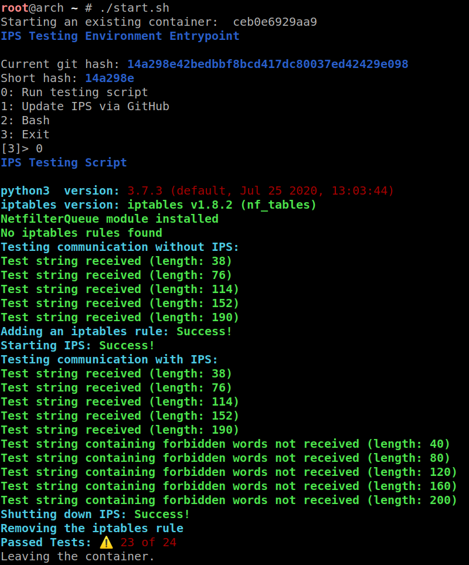

# A testing environment for [ips-cc](https://github.com/0x07cc/ips-cc)
A Docker container that downloads the latest Debian Docker image (~50MB), installs all the dependencies for ips-cc, installs NetfilterQueue and ips-cc.  
After the installation you can use the provided `./startTesting.sh` script to test ips-cc.  
To git pull (update) to a newest ips-cc version, use `./updateIPS.sh`.

## Arch Linux: Quick Start
1. Install required programs: `sudo pacman -S docker git`
1. Start Docker service: `sudo systemctl start docker.service`
1. Clone this repository: `git clone https://github.com/0x07cc/ips-cc-testing`  
`cd ips-cc-testing`
1. Build the Docker image: `sudo docker build -t ips-test-environment .`  
(Note that this will take like 5 minutes and will result in a 600+ MB image)
1. Start the testing script `./startTesting.sh`

### Useful Docker commands (use sudo if needed):
1. `docker ps -a` List containers
1. `docker rm ID` Remove container
1. `docker images` List images
1. `docker rmi IDImage` Remove image
1. `docker save -o testIPS.tar ips-test-environment` Export an image in tar format for later use
1. `docker load -i testIPS.tar` Import a tar image in Docker
1. `docker container run --cap-add=NET_ADMIN --cap-add=NET_RAW -ti ips-test-environment /bin/bash` Get a shell  
(The --cap-add flags are needed to use iptables inside the container).  

